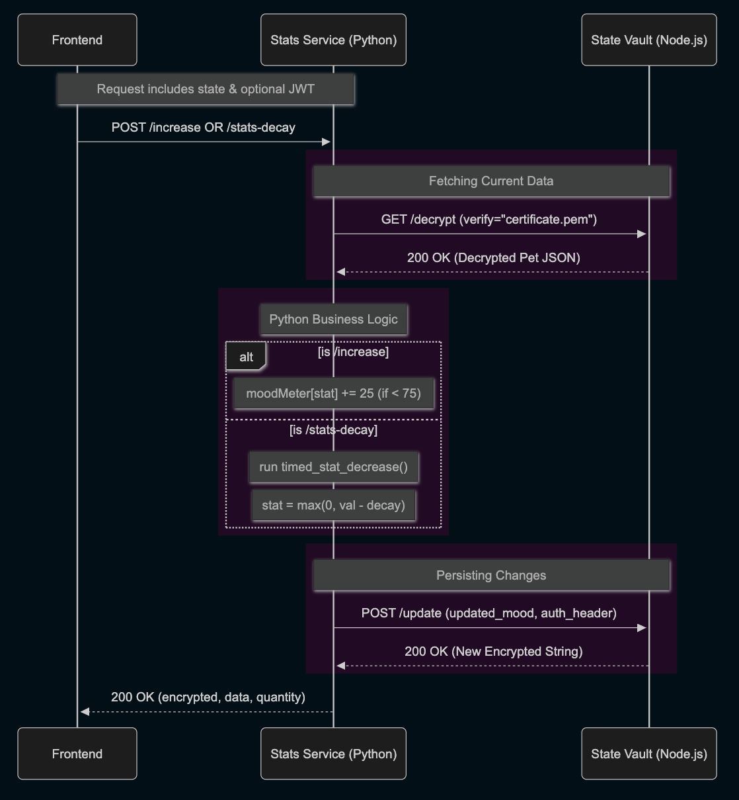

# stats-microservice

This microservice manages the logic for pet mood meters. It calculates stat increases (feeding/playing) and handles time-based stat decay based on the last recorded update. It acts as the logic "brain" that orchestrates data between the Frontend and the State Vault.

## Requirements

- Python `^3.14`
- Poetry `^2.0`
- Pipx `1.8.0`
- `certificate.pem` (The public key from State Vault for TLS verification)

To install Poetry follow [their installation documentation](https://python-poetry.org/docs/) using `pipx`

```
pipx install poetry
```

## Installation

1. Clone the repository

```
git clone [https://github.com/27Nyappy/stats-microservice.git](https://github.com/27Nyappy/stats-microservice.git)
cd stats-microservice
```

2. Setup the environment and dependencies

```
poetry install
```

This creates a virtual environment and installs all the required libraries (Flask, Pillow, etc...) as well as the internal project scripts.

3. Configure environment variables. Create a `.env` file in the root directory with the following variables and set to your custom values
```
PORT=
WILD_WAGS_HOST=
STATE_VAULT_HOST=
```

## Running the Microservice

Use the custom Poetry script to ensure everyone runs the project with the correct environment settings.

```
poetry run start
```

This executes the `main()` function in `src/service.py`

## Endpoints

### Increase Stat
`POST /increase` - Increments a specific mood meter stat by 25

### Stats decay
`POST /stats-decay` - Calculates and reduces the mood stats based on time passed since last stat decrement

### Parameters
As part of the request body

- `state` - The current encrypted state string
- `stat` - The specific stat to update (e.g. hunger)

## How to Request Data
- Method: POST
- URL local development: `https://localhost:{PORT}/increase`
- Headers: `{Authorization: "Bearer {TOKEN}"}`, optional for guest users

### Example Request
```
POST https://localhost:8003/increase
Content-Type: application/json

{
  "state": "encrypted_string_here",
  "stat": "hunger"
}
```

### How to Receive Data
- Successful response HTTP 200 returns the updated encrypted string and the raw data for UI updates
```
{
  "encrypted": "cipher:nonce:tag",
  "data": { "pet": { "moodMeter": { "hunger": 75, ... } } },
  "quantity": 25
}
```

#### Error Response
- `400` - Invalid request, for missing state or invalid stat
- `500` - Internal server error or decryption failure

## UML Sequence Diagram

